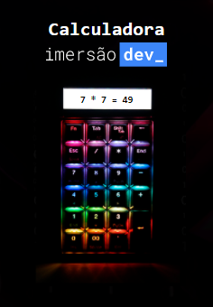
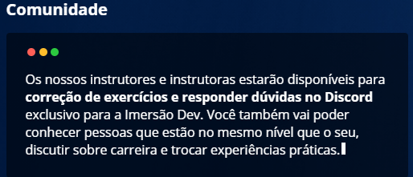
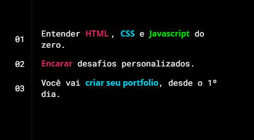
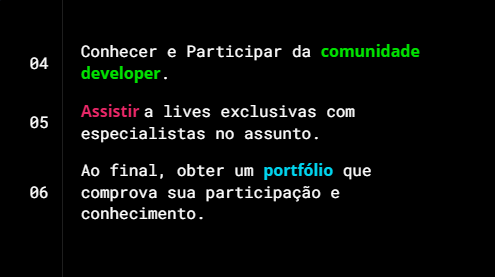

<h1 align="center">
    
</h1>

<h3 align="center">
   Marcador de Truco
</h3>

<blockquote align="center">“Marcador para jogar com amigos e competiçoest”</blockquote>

## :rocket: Tecnologias:

Esse projeto foi desenvolvido com as seguintes tecnologias:

- [HTML][html]
- [CSS][css]
- [Java][js]

## 💡 Funcionalidades

- Marcar Truco, Pontinho e Limpar placar.
- Somando pontuaçao Truco(3pts), Pontinho(1pts).

## O que é a Imersão DEV?

Um evento com 10 aulas gratuitas e desafios práticos para dar os primeiros passos na área de programação e criar seus primeiros códigos,
 Você vai aprender com quem domina o assunto e terá todo apoio da nossa equipe e comunidade durante o projeto.
 

* Aulas todos os dias.

* desafios, porque o melhor aprendizado é na prática.

* Especialistas em programação e com a qualidade da maior escola de tecnologia online do Brasil.

* São 10 aulas gratuitas para aprender a criar seus primeiros códigos e começar sua carreira em programação.

## O que você vai aprender??

 

## 🔗 Criado em CodePen 

Projeto feito na semana Imersão DEV da Alura. 🏆 [Saiba mais!](https://imersao.dev/)
 
------
Copyright (c) 2021 by Amadeu Filipe Lopes (https://codepen.io/felipelopes12/pen/JjEoNMd)

